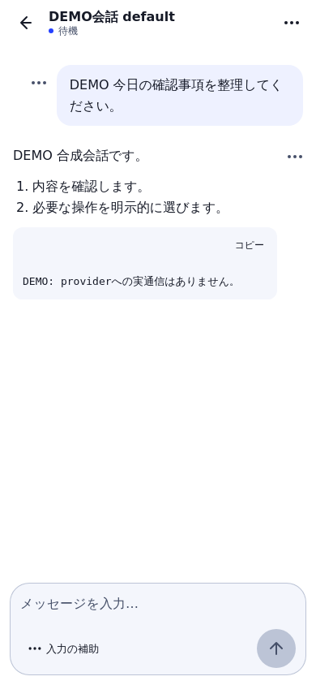
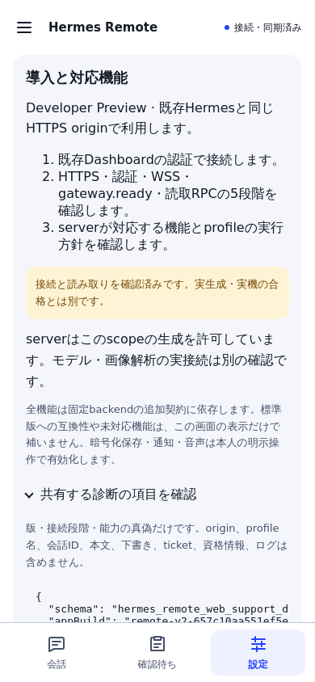

# Hermes Remote Web

An **unofficial, self-hosted mobile Web client for Hermes Agent**.
Developer Preview: Japanese interface, English/Japanese documentation, one owner,
same-origin Dashboard authentication and one foreground conversation.

[日本語](README.ja.md) · [Install](docs/OSS_INSTALL.md) ·
[Compatibility](compatibility.json) · [Roadmap](docs/OSS_ROADMAP.md) ·
[Privacy](docs/SECURITY.md) · [Security reports](SECURITY.md)

## What is available

The existing client provides profile/project/session navigation, safe Markdown and
code copy, explicit send, server approval/clarify/cancel cards, authoritative stop
and reconnect/replay, quotes, loaded-body search, expanded input, templates and
explicit Markdown export. Image/document details, canonical artifacts/files and
session model selection are capability-gated.

[Quick navigation](docs/QUICK_NAVIGATION.md) opens existing destinations/read
panels from the sidebar, Settings or Command/Control+K. Search uses Japanese or
English destination keywords; choosing does not send or approve an action.

Encrypted device drafts/history, a narrowly scoped static worker, notifications,
device speech and separate-origin navigation are optional. Default consent is off.
Native iOS source is experimental; it is not a compiled or signed app release.

**Automated fixture/Gateway tests are not proof of real provider or physical iPhone
acceptance.** Consult [release status](compatibility.json). A listed model does not
prove generation or vision support. This preview makes no claim of completed
iPhone lock recovery or paid-provider testing.

## Compatibility matters

The full feature set currently targets the fixed Hermes backend described by
[the compatibility manifest](compatibility.json). Additional contracts are
delivered as hash-locked source patches. Static files do not install those patches. [Backend preparation](docs/BACKEND_PREVIEW.md) is a separate administrator step.

An unmodified server without the Remote Web contract can offer supported reads,
but new-client generation remains disabled. Do not bypass the gate, change auth,
relax TLS/Origin or silently send with another provider.

## Build from fixed source

Node **24.18.0** and the committed lockfile:

~~~sh
npm ci --ignore-scripts --no-audit --no-fund
npm run typecheck
npm run lint
npm test -- --maxWorkers=1 --minWorkers=1
npm run build
npm run verify:pwa
npm run verify:pack
~~~

The deterministic build ID is in `releases/current-build.txt`. Use the generated
static release, not retained legacy Dashboard distribution files.

## Install and update

Serve `/hermes-remote-web/` on the same HTTPS origin as the existing authenticated
Hermes Dashboard. The Web client resolves its own origin. Keep existing auth,
API/WSS, Host/Origin checks and all other routes.

[The install guide](docs/OSS_INSTALL.md) covers verification, portable preparation,
atomic static activation and rollback. Static operations never restart Hermes,
modify provider/profile settings, alter proxy routes or force another browser to
reload. The default is dry-run.

No retained upstream plugin installer or `npx @latest` is needed. This project
does not add another Hermes engine, account database or provider credentials.

## Development and contributions

[Contributing](CONTRIBUTING.md) explains fixed dependencies, Core/Shell separation,
sanitized fixtures, DCO sign-off and verification. [The roadmap](docs/OSS_ROADMAP.md)
separates source publication from beta/device/provider acceptance.

## License and provenance

MIT for this derivative's source, with original copyright and notices retained.
Based on stasstepv/hermes-pwa at `7dc780bf80eb957ad0c2826954b54adce7db7ad5`.
Licensed Hermes shared code and backend patches retain Nous Research attribution.
**This derivative is not clean-room and is not endorsed by Nous Research.**

[Third-party notices](THIRD_PARTY_NOTICES.md) cover runtime/development dependencies.
Optional Python wheels have their own licenses, including MPL-2.0; the root MIT
license does not relicense them. Only reviewed original/DEMO media enter a public
package. Individual operational receipts and unreviewed historical media do not.

## Synthetic screenshots

These are real WebKit renders of the release candidate with **DEMO-only data**,
not real-provider or physical-iPhone evidence.

| Conversation | Setup / reviewed diagnostic fields |
| --- | --- |
|  |  |
