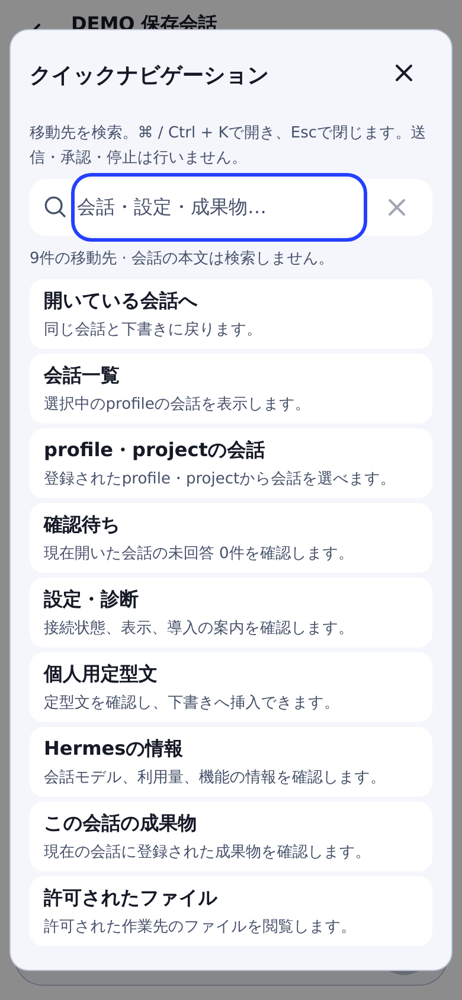
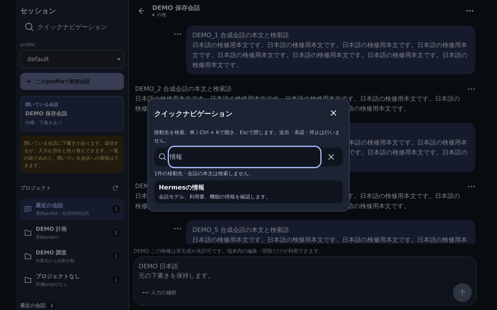

# Quick navigation

Open **クイックナビゲーション** in the profile/project sidebar or Settings.
With a hardware keyboard, press **Command+K** (Mac) or **Control+K**; use Escape or
the close button to return. The shortcut does not take over another open modal or
an active IME composition. The existing expanded editor retains its own modal.

The palette contains nine existing destinations: the current conversation,
conversation list, profile/project sidebar, pending requests, Settings/diagnostics,
personal templates, Hermes information, current artifacts and authorized files.
Unavailable destinations explain the missing conversation, connection or server
capability. A pending count covers only the current profile/live conversation.

Search built-in destination names using Japanese or English keywords. This is
literal matching, bounded to 128 characters; it does not search transcript bodies,
session titles, other profiles or unloaded server history. Down/Up moves from the
search field into enabled results. In results, Down/Up/Home/End uses the existing
menu navigation. Enter explicitly chooses a result; Tab stays inside the modal.
IME confirmation does not choose a result.

Choosing a destination performs navigation, or opens the existing read panel.
It does not submit a prompt, create/resume a session, change profile/model, answer
approval/clarify, stop a run, insert a template, save a file or grant device consent.
Panel reads use the existing capability/scoped adapter; those panels' existing
explicit operations and confirmations remain unchanged.

Closing returns focus to the originating control. Closing from the composer
retains its text/selection and transcript reading position. Switching among
existing pages uses the existing page/transcript scroll memory. Scope/auth changes
discard the open palette and its query. No new browser storage key, URL parameter,
analytics event or backend contract is added. Opening the palette also prevents
explicit update activation until it is closed.

`npm run e2e:quick-navigation` exercises the built application in both WebKit and
Chromium against loopback auth/WSS and synthetic read-panel responses. Evidence is
in `output/quick-navigation/`; it is not paid-provider, production or physical
iPhone acceptance. Existing daily UI, sidebar, typed request/unknown-send and
update/rollback regressions remain required.

## Synthetic UI examples

These are actual WebKit renders with DEMO-only data, not physical iPhone captures.

| Mobile destinations | Desktop keyword search |
| --- | --- |
|  |  |
